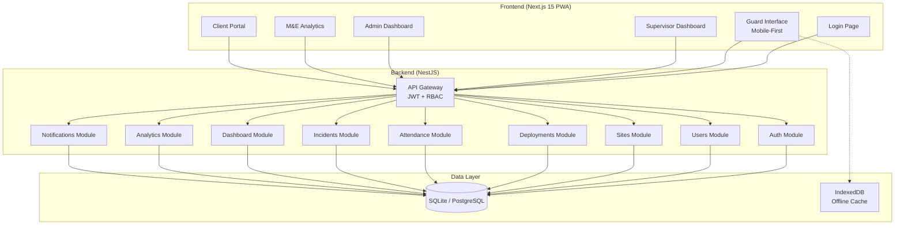
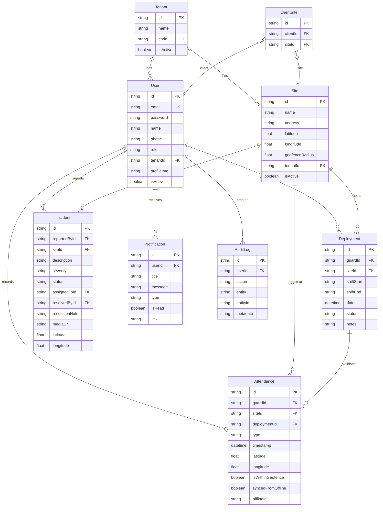

# SecureGuard Pro — Enterprise Upgrade Implementation Plan

## Current State Assessment

The existing codebase provides a solid MVP foundation:

| Layer | Current State | Status |
|-------|--------------|--------|
| **Backend** (NestJS + Prisma) | Auth, Users, Sites, Deployments, Attendance, Incidents, Dashboard modules | ✅ Functional |
| **Frontend** (Next.js 15 + Tailwind) | Login, Guard Panel, Dashboard, Admin CRUD pages (Users, Sites, Deployments, Attendance, Incidents) | ✅ Basic |
| **Database** (SQLite/Prisma) | User, Site, Deployment, Attendance, Incident, AuditLog models | ✅ Basic |
| **PWA** | manifest.json, sw.js, IndexedDB offline queue, sync service | ✅ Basic |
| **Auth** | JWT + RBAC (ADMIN, OPS_MANAGER, SUPERVISOR, GUARD, CLIENT roles) | ✅ Working |

### What's Missing for Enterprise Grade

1. **Multi-Tenant Architecture** — No Tenant model, no data isolation
2. **M&E / Analytics Role** — No analytics dashboards, no charts, no data export
3. **Client Portal** — Route exists in nav but no dedicated portal view
4. **Supervisor Interface** — Shares admin dashboard, no specialized view
5. **Advanced Incident Management** — No status workflow, no assignment, no resolution tracking
6. **Shift Scheduling** — Basic date+time only, no recurring shifts
7. **Notifications/Alerts** — None implemented
8. **Premium UI/UX** — Functional but basic; needs glassmorphism, charts, animations, proper mobile experience
9. **Guard History** — No personal attendance/incident history view
10. **Report Export** — No CSV/PDF export capability

---

## User Review Required

> [!IMPORTANT]
> **Multi-Tenancy Scope**: The current system has no Tenant model. Adding full multi-tenant isolation requires adding a `tenantId` foreign key to every model and filtering every query. This is a significant architectural change. Should we:
> - **Option A**: Add full multi-tenant support now (heavier, more complex)
> - **Option B**: Add the Tenant model and schema preparation now, but defer query-level isolation to Phase 3 (recommended — keeps Phase 1 focused)

> [!IMPORTANT]
> **Chart Library**: For the M&E analytics dashboards, I'll use lightweight chart rendering with Chart.js via `react-chartjs-2`. This keeps the bundle small and avoids heavy dependencies. Acceptable?

> [!WARNING]
> **Database Migration**: The schema changes below will require dropping and re-seeding the SQLite dev database. All existing test data will be lost. This is expected for development.

---

## Proposed Changes

### Phase 1: Core Enterprise Upgrade (This Session)

The entire system will be rebuilt with premium enterprise-grade aesthetics — every page will be visually stunning from first load.

---

### 1. Database Schema Expansion

#### [MODIFY] [schema.prisma](file:///c:/Users/USER/Music/security-system/backend/prisma/schema.prisma)

Add the following models and fields:

```prisma
// NEW: Multi-tenant support
model Tenant {
  id        String   @id @default(uuid())
  name      String
  code      String   @unique  // e.g. "ACME-SEC"
  isActive  Boolean  @default(true)
  createdAt DateTime @default(now())
  
  users       User[]
  sites       Site[]
}

// MODIFY User: add tenantId, profileImage
model User {
  // ... existing fields ...
  tenantId    String?
  profileImg  String?
  tenant      Tenant?  @relation(fields: [tenantId], references: [id])
}

// MODIFY Incident: add status workflow, assignedTo
model Incident {
  // ... existing fields ...
  status       String   @default("OPEN")    // OPEN, INVESTIGATING, RESOLVED, CLOSED
  assignedToId String?
  resolvedById String?
  resolutionNote String?
  assignedTo   User?   @relation("AssignedIncidents", ...)
  resolvedBy   User?   @relation("ResolvedIncidents", ...)
}

// NEW: Notification system
model Notification {
  id        String   @id @default(uuid())
  userId    String
  title     String
  message   String
  type      String   // ALERT, INFO, WARNING
  isRead    Boolean  @default(false)
  link      String?
  createdAt DateTime @default(now())
  user      User     @relation(fields: [userId], references: [id])
}

// NEW: Client-Site association
model ClientSite {
  id       String @id @default(uuid())
  clientId String
  siteId   String
  client   User   @relation(fields: [clientId], references: [id])
  site     Site   @relation(fields: [siteId], references: [id])
  @@unique([clientId, siteId])
}
```

#### [MODIFY] [seed.ts](file:///c:/Users/USER/Music/security-system/backend/prisma/seed.ts)

- Add Tenant creation
- Add M&E Analyst user
- Add ClientSite associations
- Add sample notifications
- Add more realistic guard data (6-8 guards)
- Add 30 days of historical attendance & deployment data for analytics

---

### 2. Backend API Expansion

#### [NEW] `backend/src/notifications/` module
- `GET /api/notifications` — get user's notifications
- `PATCH /api/notifications/:id/read` — mark as read
- `GET /api/notifications/unread-count` — unread count

#### [NEW] `backend/src/analytics/` module
- `GET /api/analytics/attendance-trend` — daily attendance counts (last 30 days)
- `GET /api/analytics/incident-trend` — daily incident counts (last 30 days)
- `GET /api/analytics/guard-performance` — per-guard attendance metrics
- `GET /api/analytics/site-summary` — per-site deployment & incident stats
- `GET /api/analytics/export` — CSV export of filtered data

#### [MODIFY] [dashboard.service.ts](file:///c:/Users/USER/Music/security-system/backend/src/dashboard/dashboard.service.ts)
- Add `getGuardDashboard(guardId)` — personal stats for guard
- Add `getSupervisorDashboard(userId)` — supervisor-specific view
- Add `getClientDashboard(clientId)` — client-scoped stats (only their sites)

#### [MODIFY] [incidents.service.ts](file:///c:/Users/USER/Music/security-system/backend/src/incidents/incidents.service.ts)
- Add incident status transitions (OPEN → INVESTIGATING → RESOLVED → CLOSED)
- Add `assignIncident(id, assigneeId)`
- Add `resolveIncident(id, resolvedById, note)`

#### [MODIFY] [deployments.service.ts](file:///c:/Users/USER/Music/security-system/backend/src/deployments/deployments.service.ts)  
- Add `getGuardDeployment(guardId)` — get current/next deployment for a guard
- Filter deployments by guard for supervisor view

---

### 3. Frontend — Premium UI Overhaul

#### [MODIFY] [globals.css](file:///c:/Users/USER/Music/security-system/frontend/src/app/globals.css)

Complete design system rewrite:
- Glassmorphism cards with `backdrop-filter: blur()`
- Gradient accent backgrounds  
- Premium dark theme with depth layers
- Smooth micro-animations (stagger, scale, glow)
- Custom scrollbar, form focus effects
- Responsive grid system
- Chart container styles
- Toast notification system with slide-in animations

#### [MODIFY] [layout.tsx (app)](file:///c:/Users/USER/Music/security-system/frontend/src/app/(app)/layout.tsx)

Premium sidebar redesign:
- Gradient logo area with animated shield icon
- Collapsible sidebar with smooth transitions
- Notification bell with unread count badge
- Online/offline status indicator in header
- Animated active link indicators
- Role-based navigation sections with icons
- User profile card with avatar

---

### 4. Frontend — Role-Based Interfaces

#### Guard Interface (Mobile-First)

##### [MODIFY] [guard/page.tsx](file:///c:/Users/USER/Music/security-system/frontend/src/app/(app)/guard/page.tsx)

Complete rewrite as premium mobile interface:
- **Shift Card** — Shows current deployment, site name, shift time, countdown timer
- **Check-in/out** — Large animated buttons with GPS validation feedback
- **My History** — Tabbed view of recent attendance + incidents
- **Incident Report** — Expandable form with severity color coding
- **Status Bar** — GPS, online/offline, pending sync, current time
- Visual feedback: success/error animations, geofence status glow

#### Supervisor Interface

##### [NEW] `frontend/src/app/(app)/supervisor/page.tsx`

- **Live Guard Map** — Table showing all guards' current status (on-duty, checked-in, off-duty)
- **Today's Deployments** — Active deployments with attendance status per guard
- **Quick Deploy** — Assign guard to site right from dashboard
- **Anomaly List** — Guards who checked in outside geofence, or missed check-in
- **Active Incidents** — Real-time incident feed with assignment actions

#### Admin Dashboard

##### [MODIFY] [dashboard/page.tsx](file:///c:/Users/USER/Music/security-system/frontend/src/app/(app)/dashboard/page.tsx)

Premium redesign:
- **KPI Cards** — Active guards, attendance rate, incidents, compliance (with sparkline trends)
- **Activity Feed** — Real-time system events (check-ins, incidents, deployments)
- **Quick Actions** — Create user, create site, assign deployment
- **System Health** — Summary of all active/inactive sites

##### [MODIFY] Admin CRUD Pages (Users, Sites, Deployments, Attendance, Incidents)
- Add search/filter bars
- Add pagination
- Better modal forms
- Bulk actions
- Status badges with colors
- Edit/delete confirmation modals

#### M&E / Analytics Dashboard

##### [NEW] `frontend/src/app/(app)/analytics/page.tsx`

- **Attendance Trend Chart** — Line chart (30 days)
- **Incident Frequency Chart** — Bar chart by severity
- **Guard Performance Table** — Sortable by attendance rate, incidents reported
- **Site Summary Cards** — Per-site metrics
- **Date Range Filter** — Custom date picker for filtering
- **Export Button** — Download CSV of current view
- **Geofence Compliance Gauge** — Radial chart

#### Client Portal

##### [NEW] `frontend/src/app/(app)/client/page.tsx`

- **My Sites** — Cards showing each assigned site
- **Guard Roster** — Who is/was deployed at their sites
- **Attendance Log** — Filtered to their sites only
- **Incident Log** — Filtered to their sites only
- **Service Summary** — Monthly compliance metrics
- Read-only, clean, professional interface

---

### 5. PWA Enhancement

#### [MODIFY] [sw.js](file:///c:/Users/USER/Music/security-system/frontend/public/sw.js)
- Improved cache strategies (NetworkFirst for API, CacheFirst for assets)
- Better offline page handling
- Push notification support skeleton

#### [MODIFY] [manifest.json](file:///c:/Users/USER/Music/security-system/frontend/public/manifest.json)
- Updated icons, theme colors
- Proper PWA categories and shortcuts

---

### 6. Frontend Libraries

#### [MODIFY] [package.json](file:///c:/Users/USER/Music/security-system/frontend/package.json)

Add:
- `chart.js` + `react-chartjs-2` — for analytics charts
- `date-fns` — lightweight date formatting

---

## Architecture Diagram



---

## Database Schema (Complete)



---

## API Design (Complete)

### Existing Endpoints (Enhanced)
| Method | Endpoint | Changes |
|--------|----------|---------|
| `POST` | `/api/auth/login` | No change |
| `GET` | `/api/auth/me` | Add tenant info |
| `GET/POST` | `/api/users` | Add M&E_ANALYST role |
| `GET/POST` | `/api/sites` | Add tenantId filter |
| `GET/POST` | `/api/deployments` | Add guardId filter, status transitions |
| `POST` | `/api/attendance/check-in` | No change |
| `POST` | `/api/attendance/check-out` | No change |
| `POST` | `/api/attendance/sync` | No change |
| `GET/POST` | `/api/incidents` | Add status, assignedTo fields |
| `PATCH` | `/api/incidents/:id/assign` | **New** — assign to user |
| `PATCH` | `/api/incidents/:id/resolve` | **New** — resolve with note |

### New Endpoints
| Method | Endpoint | Role Access | Description |
|--------|----------|-------------|-------------|
| `GET` | `/api/dashboard/guard` | GUARD | Guard personal dashboard |
| `GET` | `/api/dashboard/supervisor` | SUPERVISOR | Supervisor overview |
| `GET` | `/api/dashboard/client` | CLIENT | Client-scoped dashboard |
| `GET` | `/api/analytics/attendance-trend` | ADMIN, M&E | 30-day attendance chart data |
| `GET` | `/api/analytics/incident-trend` | ADMIN, M&E | 30-day incident chart data |
| `GET` | `/api/analytics/guard-performance` | ADMIN, M&E, SUPERVISOR | Per-guard metrics |
| `GET` | `/api/analytics/site-summary` | ADMIN, M&E | Per-site performance |
| `GET` | `/api/analytics/export` | ADMIN, M&E | CSV data export |
| `GET` | `/api/notifications` | ALL | User's notifications |
| `PATCH` | `/api/notifications/:id/read` | ALL | Mark notification read |
| `GET` | `/api/notifications/unread-count` | ALL | Unread count |

---

## Open Questions

> [!IMPORTANT]
> 1. **Multi-Tenant Scope** — Option A (full now) or Option B (schema now, isolation later)?
> 2. **Chart Library** — Chart.js acceptable, or prefer something else?
> 3. **Should I proceed** with building this entire Phase 1 in one execution session? It's ~30+ files to create/modify but all are logically connected.

---

## Verification Plan

### Automated Tests
1. Start backend: `cd backend && npm run dev` — verify API starts without errors
2. Run Prisma migration: `npx prisma migrate dev` — verify schema applies cleanly
3. Run seed: `npm run prisma:seed` — verify all demo data creates
4. Start frontend: `cd frontend && npm run dev` — verify all pages render
5. Browser test: Login with each role and verify correct interface loads

### Manual Verification
- Login as each role (Admin, Supervisor, Guard, Client, M&E) and verify:
  - Correct navigation items appear
  - Dashboard shows role-appropriate data
  - CRUD operations work
  - Charts render with data
  - Offline mode functions on Guard interface
  - PWA installs correctly
